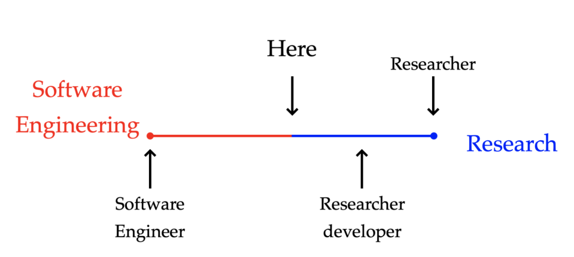
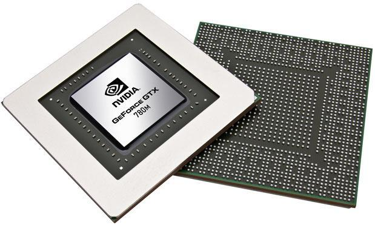

#### {background-color="black"}
#### Research Software Engineer?

{width=70%}

A new role in the department

#### Mission {background-image="img/wave-background.jpg"}

- Develop CFD software (xcompact3d, nektar++, pyFR).
- Provide software engineering expertise.
- Promote software development best practices.
- Deliver workshop/training courses.

#### GPU support for xcompact3d

{width=30%}

. . .

First step: infrastructure overhaul

- Automated software tests.
- Continuous Integration (GitHub actions).
- Portable compilation process.

#### things I can help you with {background-color="green"}
- Code review, code organisation.
- Documentation, software testing.
- Version control (Git).
- Packaging and distribution, code reuse.
- Data analysis workflows, reproducibility.
- Development environments (e.g. text editors).
- General programming advice/questions.

#### Contact

t.lestang@imperial.ac.uk

Room 420, glass office on the right

In Mondays, Wednesdays (Fridays)

#### I don't know (much) about {background-color="#C72A3D"}
- Configuring printers
- Recovering passwords
- Fixing your laptop
- Managing software licences

. . .

- ... and many other things.

#### About me
- Studied Physics at Université Paris-Saclay and ENS Lyon.
- PhD in computational physics (Lattice Boltzmann + rare event sampling algorithms).
- Permformance engineer at HPC center Stuttart.
- RSE in the Oxford Research Software Engineering group.

Physicist turned RSE.

#### Let's chat

{width=10%}

- Questions.
- Things you would like to learn about.
- generale software -related issues you've been having.
- Things you are interested in at the moment.
